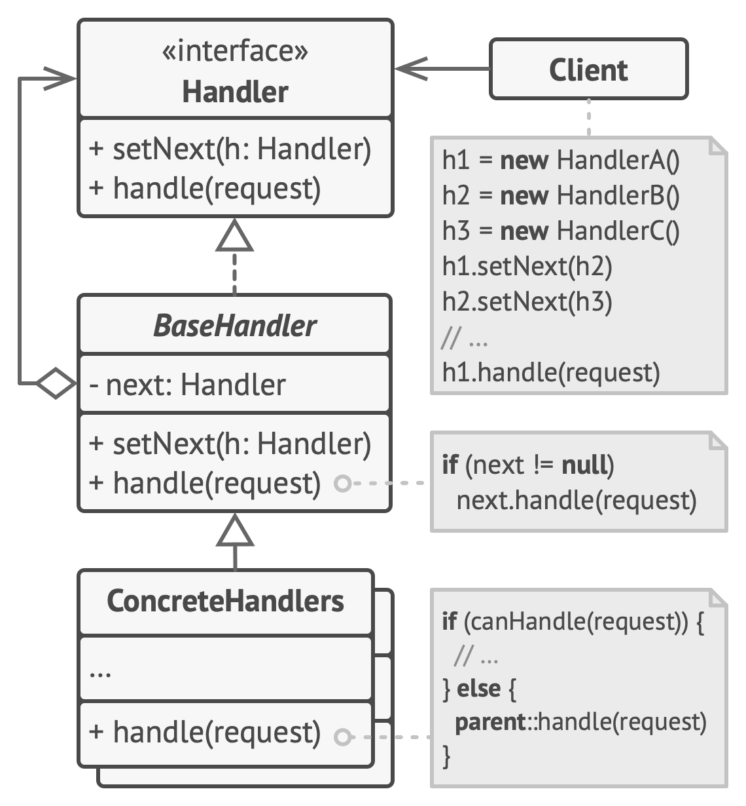

# Chain od Responsibilities

**Chain of Responsibility** is a behavioral design pattern that lets you pass requests along a chain of handlers. Upon receiving a request, each handler decides either to process the request or to pass it to the next handler in the chain.

Frequency of use 

## Intent
* Avoid coupling the sender of a request to its receiver by giving more than one object a chance to handle the request. Chain the receiving objects and pass the request along the chain until an object handles it.
* Launch-and-leave requests with a single processing pipeline that contains many possible handlers.
* An object-oriented linked list with recursive traversal.

## Problem
There is a potentially variable number of "handler" or "processing element" or "node" objects, and a stream of requests that must be handled. Need to efficiently process the requests without hard-wiring handler relationships and precedence, or request-to-handler mappings.

## Structure

## Participants
The classes and objects participating in this pattern include:

* **Handler** (*Approver*)
  * defines an interface for handling the requests
  * (optional) implements the successor link
* **ConcreteHandler** (*Director*, *VicePresident*, *President*)
  * handles requests it is responsible for
  * can access its successor
  * if the ConcreteHandler can handle the request, it does so; otherwise it forwards the request to its successor
* **Client** (*ChainApp*)
  * initiates the request to a ConcreteHandler object on the chain