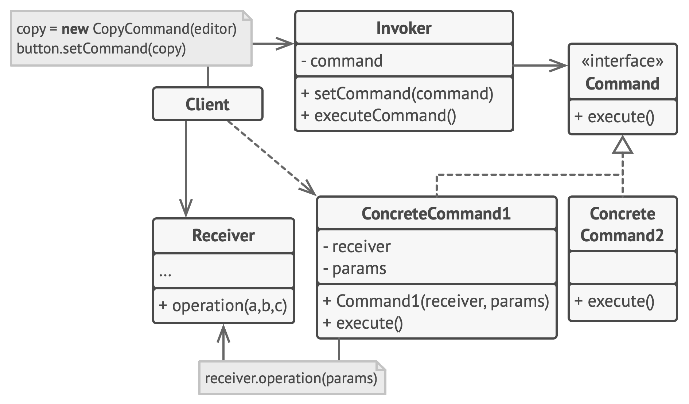

# Command

**Command** is a behavioral design pattern that turns a request into a stand-alone object that contains all information about the request. This transformation lets you pass requests as a method arguments, delay or queue a request’s execution, and support undoable operations.

Frequency of use 

## Intent
* Encapsulate a request as an object, thereby letting you parametrize clients with different requests, queue or log requests, and support undoable operations.
* Promote "invocation of a method on an object" to full object status
* An object-oriented callback

## Problem
Need to issue requests to objects without knowing anything about the operation being requested or the receiver of the request.

## Structure

## Participants
The classes and objects participating in this pattern include:

* **Command** (*Command*)
  * declares an interface for executing an operation
* **ConcreteCommand** (*CalculatorCommand*)
  * defines a binding between a Receiver object and an action
  * implements Execute by invoking the corresponding operation(s) on Receiver
* **Client** (*CommandApp*)
  * creates a ConcreteCommand object and sets its receiver
* **Invoker** (*User*)
  * asks the command to carry out the request
* **Receiver** (*Calculator*)
  * knows how to perform the operations associated with carrying out the request.