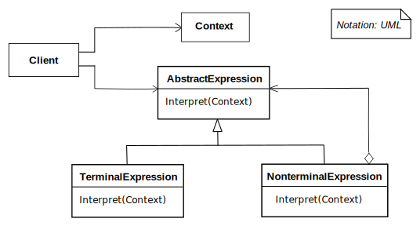

# Interpreter

Given a language, the **Interpreter** design pattern defines a representation for its grammar along with an interpreter that uses the representation to interpret sentences in the language. 

Frequency of use 

## Intent
* Given a language, define a representation for its grammar along with an interpreter that uses the representation to interpret sentences in the language.
* Map a domain to a language, the language to a grammar, and the grammar to a hierarchical object-oriented design.

## Problem
A class of problems occurs repeatedly in a well-defined and well-understood domain. If the domain were characterized with a "language", then problems could be easily solved with an interpretation "engine".

## Structure

## Participants
The classes and objects participating in this pattern include:

* **AbstractExpression** (*Expression*)
  * declares an interface for executing an operation
* **TerminalExpression** (*ThousandExpression*, *HundredExpression*, *TenExpression*, *OneExpression*)
  * implements an Interpret operation associated with terminal symbols in the grammar.
  * an instance is required for every terminal symbol in the sentence.
* **NonterminalExpression**  ( not used )
  * one such class is required for every rule R ::= R1R2...Rn in the grammar
  * maintains instance variables of type AbstractExpression for each of the symbols R1 through Rn.
  * implements an Interpret operation for nonterminal symbols in the grammar. Interpret typically calls itself recursively on the variables representing R1 through Rn.
* **Context**  (*Context*)
  * contains information that is global to the interpreter
* **Client**  (*InterpreterApp*)
  * builds (or is given) an abstract syntax tree representing a particular sentence in the language that the grammar defines. The abstract syntax tree is assembled from instances of the NonterminalExpression and TerminalExpression classes
  * invokes the Interpret operation