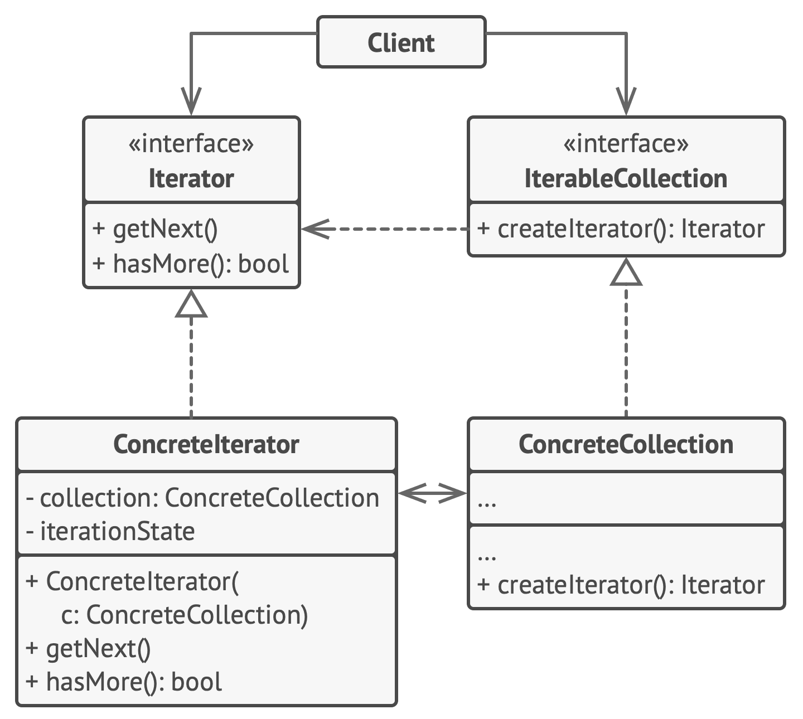

# Iterator

**Iterator** is a behavioral design pattern that lets you traverse elements of a collection without exposing its underlying representation (list, stack, tree, etc.).

Frequency of use 

## Intent
* Provide a way to access the elements of an aggregate object sequentially without exposing its underlying representation.
* The C++ and Java standard library abstraction that makes it possible to decouple collection classes and algorithms.
* Promote to "full object status" the traversal of a collection.
* Polymorphic traversal

## Problem
Need to "abstract" the traversal of wildly different data structures so that algorithms can be defined that are capable of interfacing with each transparently.

## Structure

## Participants
The classes and objects participating in this pattern include:

* **Iterator** (*AbstractIterator*)
  * defines an interface for accessing and traversing elements.
* **ConcreteIterator** (*Iterator*)
  * implements the Iterator interface.
  * keeps track of the current position in the traversal of the aggregate.
* **Aggregate** (*AbstractCollection*)
  * defines an interface for creating an Iterator object
* **ConcreteAggregate** (*Collection*)
  * implements the Iterator creation interface to return an instance of the proper ConcreteIterator