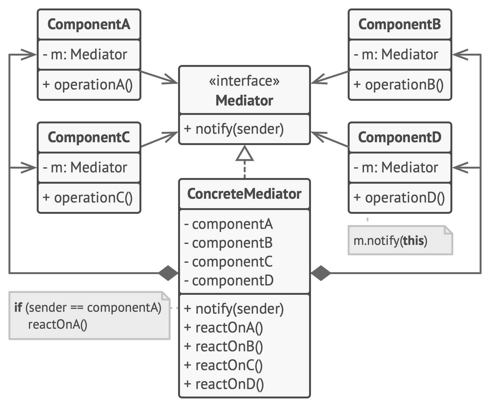

# Mediator

**Mediator** is a behavioral design pattern that lets you reduce chaotic dependencies between objects. The pattern restricts direct communications between the objects and forces them to collaborate only via a mediator object.

Frequency of use 

## Intent
* Define an object that encapsulates how a set of objects interact. Mediator promotes loose coupling by keeping objects from referring to each other explicitly, and it lets you vary their interaction independently.
* Design an intermediary to decouple many peers.
* Promote the many-to-many relationships between interacting peers to "full object status".

## Problem
We want to design reusable components, but dependencies between the potentially reusable pieces demonstrates the "spaghetti code" phenomenon (trying to scoop a single serving results in an "all or nothing clump").

## Structure

## Participants
The classes and objects participating in this pattern include:

* **Mediator** (*IChatroom*)
  * defines an interface for communicating with Colleague objects
* **ConcreteMediator** (*Chatroom*)
  * implements cooperative behavior by coordinating Colleague objects
knows and maintains its colleagues
* **Colleague classes** (*Participant*)
  * each Colleague class knows its Mediator object
  * each colleague communicates with its mediator whenever it would have otherwise communicated with another colleague