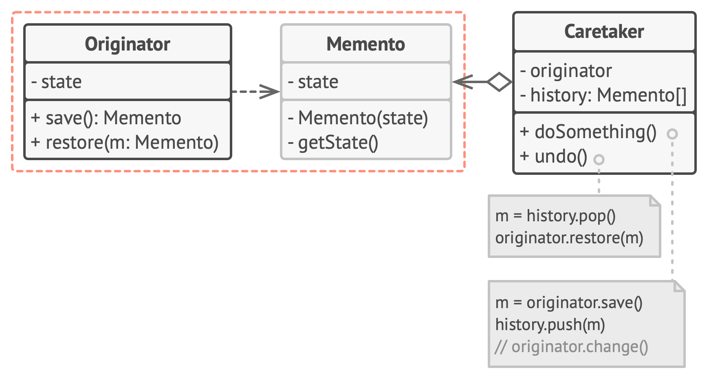

# Memento

**Memento** is a behavioral design pattern that lets you save and restore the previous state of an object without revealing the details of its implementation.

Frequency of use 

## Intent
* Without violating encapsulation, capture and externalize an object's internal state so that the object can be returned to this state later.
* A magic cookie that encapsulates a "check point" capability.
* Promote undo or rollback to full object status.

## Problem
Need to restore an object back to its previous state (e.g. "undo" or "rollback" operations).

## Structure

## Participants
The classes and objects participating in this pattern include:

* **Memento** (*Memento*)
  * stores internal state of the Originator object. The memento may store as much or as little of the originator's internal state as necessary at its originator's discretion.
  * protect against access by objects of other than the originator. Mementos have effectively two interfaces. Caretaker sees a narrow interface to the Memento -- it can only pass the memento to the other objects. Originator, in contrast, sees a wide interface, one that lets it access all the data necessary to restore itself to its previous state. Ideally, only the originator that produces the memento would be permitted to access the memento's internal state.
* **Originator** (*SalesProspect*)
  * creates a memento containing a snapshot of its current internal state.
  * uses the memento to restore its internal state
* **Caretaker** (*Caretaker*)
  * is responsible for the memento's safekeeping
  * never operates on or examines the contents of a memento.