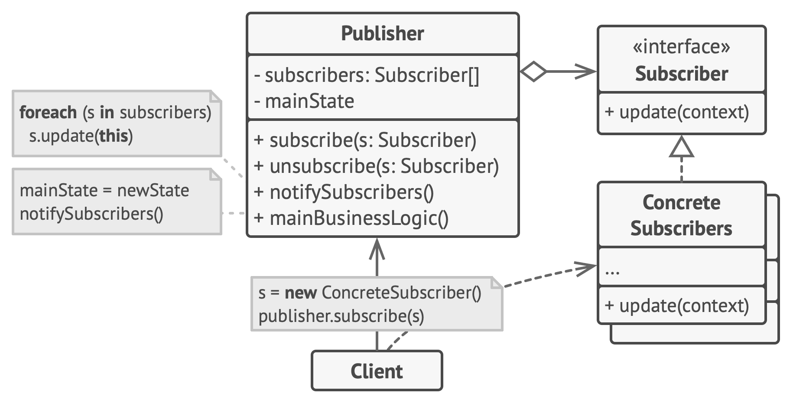

# Observer

**Observer** is a behavioral design pattern that lets you define a subscription mechanism to notify multiple objects about any events that happen to the object they’re observing.

Frequency of use 

## Intent
* Define a one-to-many dependency between objects so that when one object changes state, all its dependents are notified and updated automatically.
* Encapsulate the core (or common or engine) components in a Subject abstraction, and the variable (or optional or user interface) components in an Observer hierarchy.
* The "View" part of Model-View-Controller.

## Problem
A large monolithic design does not scale well as new graphing or monitoring requirements are levied.

## Structure

## Participants
The classes and objects participating in this pattern include:

* **Subject** (*Stock*)
  * knows its observers. Any number of Observer objects may observe a subject
provides an interface for attaching and detaching Observer objects.
* **ConcreteSubject** (*IBM*)
  * stores state of interest to ConcreteObserver
sends a notification to its observers when its state changes
* **Observer** (*IInvestor*)
  * defines an updating interface for objects that should be notified of changes in a subject.
* **ConcreteObserver** (*Investor*)
  * maintains a reference to a ConcreteSubject object
  * stores state that should stay consistent with the subject's
  * implements the Observer updating interface to keep its state consistent with the subject's