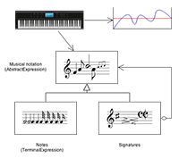

# Behavioral Design Patterns

Behavioral design patterns are concerned with algorithms and the assignment of responsibilities between objects.

* [**Chain of Responsibility**](./ChainOfResponsibility/)

  

  Lets you pass requests along a chain of handlers. Upon receiving a request, each handler decides either to process the request or to pass it to the next handler in the chain.

* [**Command**](./Command/)

  

  Turns a request into a stand-alone object that contains all information about the request. This transformation lets you pass requests as a method arguments, delay or queue a request's execution, and support undoable operations.

* [**Interpreter**](./Interpreter/)

  

  Given a language, defines a representation for its grammar along with an interpreter that uses the representation to interpret sentences in the language. 

* [**Iterator**](./Iterator/)

  

  Lets you traverse elements of a collection without exposing its underlying representation (list, stack, tree, etc.).

* [**Mediator**](./Mediator/)

  

  Lets you reduce chaotic dependencies between objects. The pattern restricts direct communications between the objects and forces them to collaborate only via a mediator object.

* [**Memento**](./Memento/)

  

  Lets you save and restore the previous state of an object without revealing the details of its implementation.

* [**Observer**](./Observer/)

  

  Lets you define a subscription mechanism to notify multiple objects about any events that happen to the object they're observing.

* [**State**](./State/)

  

  Lets an object alter its behavior when its internal state changes. It appears as if the object changed its class.

* [**Strategy**](./Strategy/)

  

  Lets you define a family of algorithms, put each of them into a separate class, and make their objects interchangeable.

* [**Template Method**](./TemplateMethod/)

  

  Defines the skeleton of an algorithm in the superclass but lets subclasses override specific steps of the algorithm without changing its structure.

* [**Visitor**](./Visitor/)

  

  Lets you separate algorithms from the objects on which they operate.