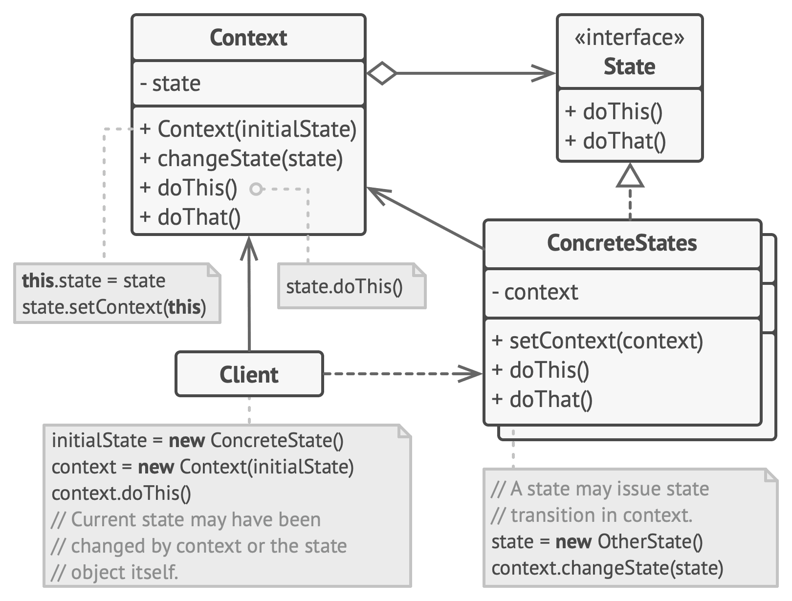

# State

**State** is a behavioral design pattern that lets an object alter its behavior when its internal state changes. It appears as if the object changed its class.

Frequency of use 

## Intent
* Allow an object to alter its behavior when its internal state changes. The object will appear to change its class.
* An object-oriented state machine
* wrapper + polymorphic wrappee + collaboration

## Problem
A monolithic object's behavior is a function of its state, and it must change its behavior at run-time depending on that state. Or, an application is characterized by large and numerous case statements that vector flow of control based on the state of the application.

## Structure

## Participants
The classes and objects participating in this pattern include:

* **Context** (*Account*)
  * defines the interface of interest to clients
  * maintains an instance of a ConcreteState subclass that defines the current state.
* **State**  (*State*)
  * defines an interface for encapsulating the behavior associated with a particular state of the Context.
* **Concrete State** (*RedState*, *SilverState*, *GoldState*)
  * each subclass implements a behavior associated with a state of Context