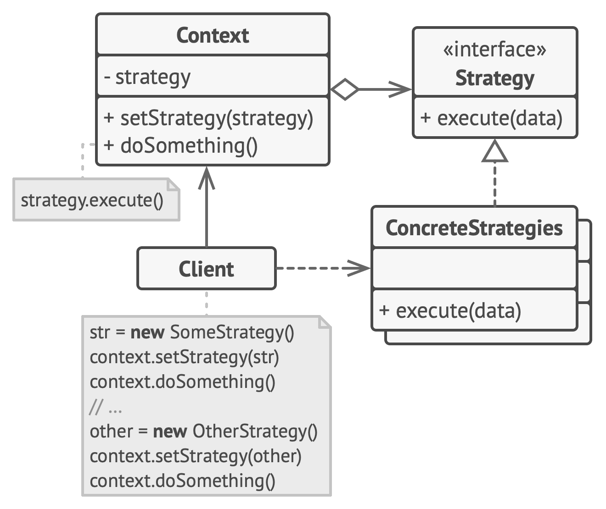

# Strategy

**Strategy** is a behavioral design pattern that lets you define a family of algorithms, put each of them into a separate class, and make their objects interchangeable.

Frequency of use 

## Intent
* Define a family of algorithms, encapsulate each one, and make them interchangeable. Strategy lets the algorithm vary independently from the clients that use it.
* Capture the abstraction in an interface, bury implementation details in derived classes.

## Problem
One of the dominant strategies of object-oriented design is the "open-closed principle".

## Structure

## Participants
The classes and objects participating in this pattern include:

* **Strategy** (*SortStrategy*)
  * declares an interface common to all supported algorithms. Context uses this interface to call the algorithm defined by a ConcreteStrategy
* **ConcreteStrategy** (*QuickSort*, *ShellSort*, *MergeSort*)
  * implements the algorithm using the Strategy interface
* **Context** (*SortedList*)
  * is configured with a ConcreteStrategy object
  * maintains a reference to a Strategy object
  * may define an interface that lets Strategy access its data.