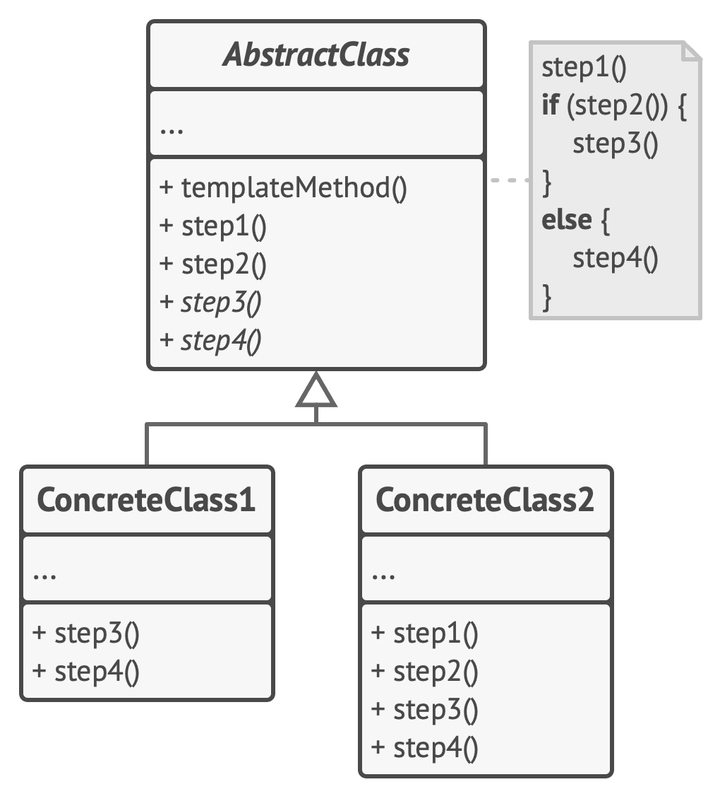

# Template Method

**Template Method** is a behavioral design pattern that defines the skeleton of an algorithm in the superclass but lets subclasses override specific steps of the algorithm without changing its structure.

Frequency of use 

## Intent
* Define the skeleton of an algorithm in an operation, deferring some steps to client subclasses. Template Method lets subclasses redefine certain steps of an algorithm without changing the algorithm's structure.
* Base class declares algorithm 'placeholders', and derived classes implement the placeholders.

## Problem
Two different components have significant similarities, but demonstrate no reuse of common interface or implementation. If a change common to both components becomes necessary, duplicate effort must be expended.

## Structure

## Participants
The classes and objects participating in this pattern include:

* **AbstractClass** (*DataObject*)
  * defines abstract primitive operations that concrete subclasses define to implement steps of an algorithm
  * implements a template method defining the skeleton of an algorithm. The template method calls primitive operations as well as operations defined in AbstractClass or those of other objects.
* **ConcreteClass** (*CustomerDataObject*)
  * implements the primitive operations to carry out subclass-specific steps of the algorithm