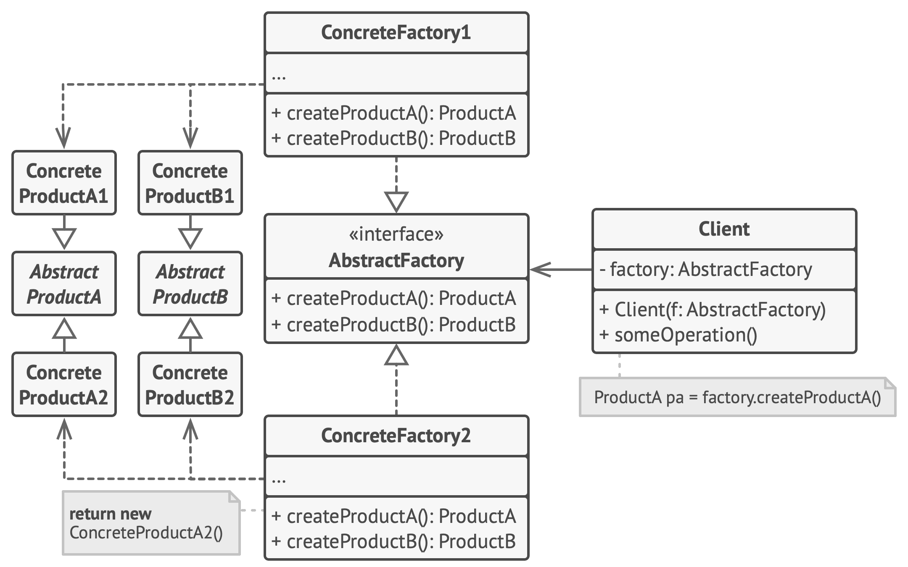

# Abstract Factory

**Abstract Factory** is a creational design pattern that lets you produce families of related objects without specifying their concrete classes.

Frequency of use 

## Intent
* Provide an interface for creating families of related or dependent objects without specifying their concrete classes.
* A hierarchy that encapsulates: many possible "platforms", and the construction of a suite of "products".
* The `new` operator considered harmful.

## Problem
If an application is to be portable, it needs to encapsulate platform dependencies. These "platforms" might include: windowing system, operating system, database, etc. Too often, this encapsulation is not engineered in advance, and lots of `#ifdef` case statements with options for all currently supported platforms begin to procreate like rabbits throughout the code.

## Structure

## Participants
The classes and objects participating in this pattern include:

* **AbstractFactory** (*ContinentFactory*)
  * declares an interface for operations that create abstract products
* **ConcreteFactory** (*AfricaFactory*, *AmericaFactory*)
  * implements the operations to create concrete product objects
* **AbstractProduct** (*Herbivore*, *Carnivore*)
  * declares an interface for a type of product object
* **Product** (*Wildebeest*, *Lion*, *Bison*, *Wolf*)
  * defines a product object to be created by the corresponding concrete factory
  * implements the AbstractProduct interface
* **Client** (*AnimalWorld*)
  * uses interfaces declared by AbstractFactory and AbstractProduct classes