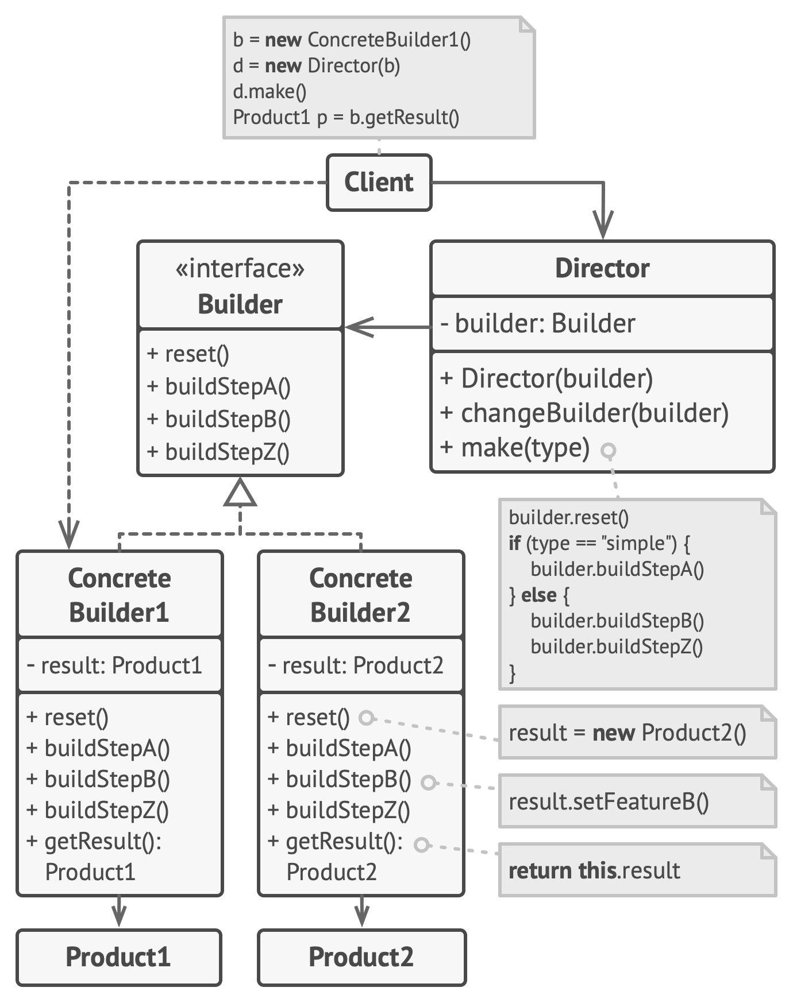

# Builder

**Builder** is a creational design pattern that lets you construct complex objects step by step. The pattern allows you to produce different types and representations of an object using the same construction code.

Frequency of use 

## Intent
* Separate the construction of a complex object from its representation so that the same construction process can create different representations.
* Parse a complex representation, create one of several targets.

## Problem
An application needs to create the elements of a complex aggregate. The specification for the aggregate exists on secondary storage and one of many representations needs to be built in primary storage.

## Structure

## Participants
The classes and objects participating in this pattern include:

* **Builder** (*VehicleBuilder*)
  * specifies an abstract interface for creating parts of a Product object
* **ConcreteBuilder** (*MotorCycleBuilder*, *CarBuilder*, *ScooterBuilder*)
  * constructs and assembles parts of the product by implementing the Builder interface
  * defines and keeps track of the representation it creates
  * provides an interface for retrieving the product
* **Director** (*Shop*)
  * constructs an object using the Builder interface
* **Product** (*Vehicle*)
  * represents the complex object under construction. ConcreteBuilder builds the product's internal representation and defines the process by which it's assembled
  * includes classes that define the constituent parts, including interfaces for assembling the parts into the final result