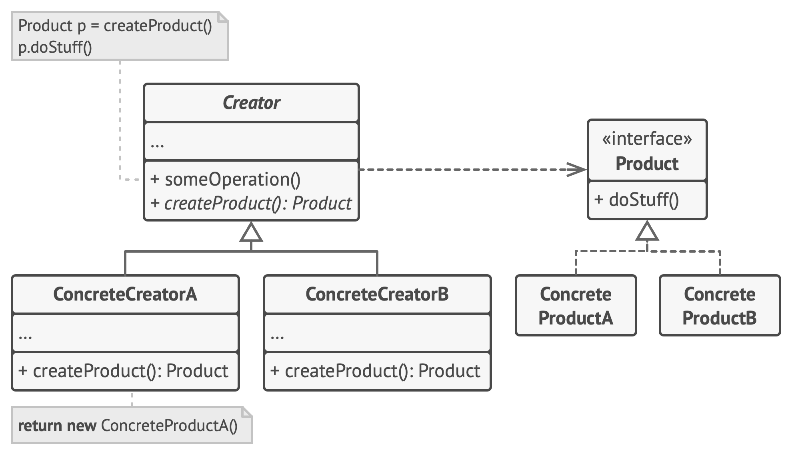

# Factory Method

**Factory Method** is a creational design pattern that provides an interface for creating objects in a superclass, but allows subclasses to alter the type of objects that will be created.

Frequency of use 

## Intent
* Define an interface for creating an object, but let subclasses decide which class to instantiate. Factory Method lets a class defer instantiation to subclasses.
* Defining a "virtual" constructor.
* The `new` operator considered harmful.

## Problem
A framework needs to standardize the architectural model for a range of applications, but allow for individual applications to define their own domain objects and provide for their instantiation.

## Structure

## Participants
The classes and objects participating in this pattern include:

* **Product** (*Page*)
  * defines the interface of objects the factory method creates
* **ConcreteProduct** (*SkillsPage*, *EducationPage*, *ExperiencePage*)
  * implements the Product interface
* **Creator** (*Document*)
  * declares the factory method, which returns an object of type Product. Creator may also define a default implementation of the factory method that returns a default ConcreteProduct object.
  * may call the factory method to create a Product object.
* **ConcreteCreator** (*Report*, *Resume*)
  * overrides the factory method to return an instance of a ConcreteProduct.