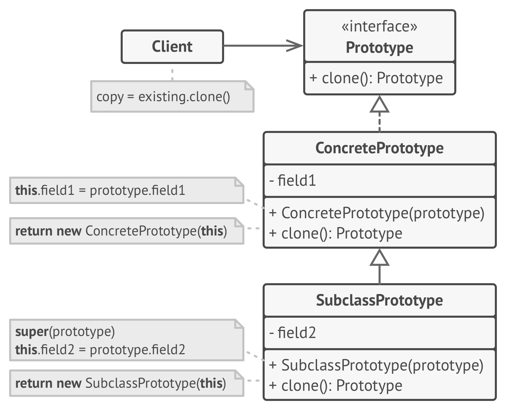

# Prototype

**Prototype** is a creational design pattern that lets you copy existing objects without making your code dependent on their classes.

Frequency of use 

## Intent
* Specify the kinds of objects to create using a prototypical instance, and create new objects by copying this prototype.
* Co-opt one instance of a class for use as a breeder of all future instances.
* The `new` operator considered harmful.

## Problem
Application "hard wires" the class of object to create in each "new" expression.

## Structure

## Participants
The classes and objects participating in this pattern include:

* **Prototype** (*ColorPrototype*)
  * declares an interface for cloning itself
* **ConcretePrototype** (*Color*)
  * implements an operation for cloning itself
* **Client** (*ColorManager*)
  * creates a new object by asking a prototype to clone itself