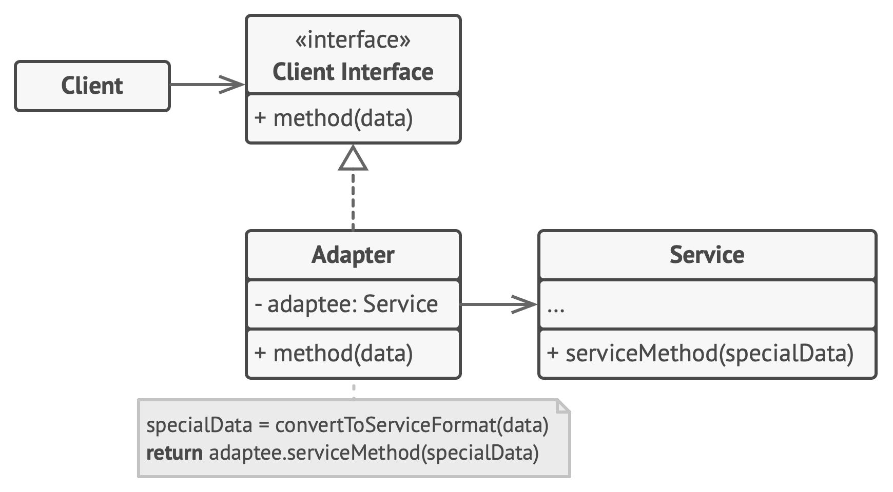

# Adapter

**Adapter** is a structural design pattern that allows objects with incompatible interfaces to collaborate.

Frequency of use 

## Intent
* Convert the interface of a class into another interface clients expect. Adapter lets classes work together that couldn't otherwise because of incompatible interfaces.
* Wrap an existing class with a new interface.
* Impedance match an old component to a new system

## Problem
An "off the shelf" component offers compelling functionality that you would like to reuse, but its "view of the world" is not compatible with the philosophy and architecture of the system currently being developed.

## Structure

## Participants
The classes and objects participating in this pattern include:

* **Target** (*ChemicalCompound*)
  * defines the domain-specific interface that Client uses.
* **Adapter** (*Compound*)
  * adapts the interface Adaptee to the Target interface.
* **Adaptee** (*ChemicalDatabank*)
  * defines an existing interface that needs adapting.
* **Client** (*AdapterApp*)
  * collaborates with objects conforming to the Target interface.