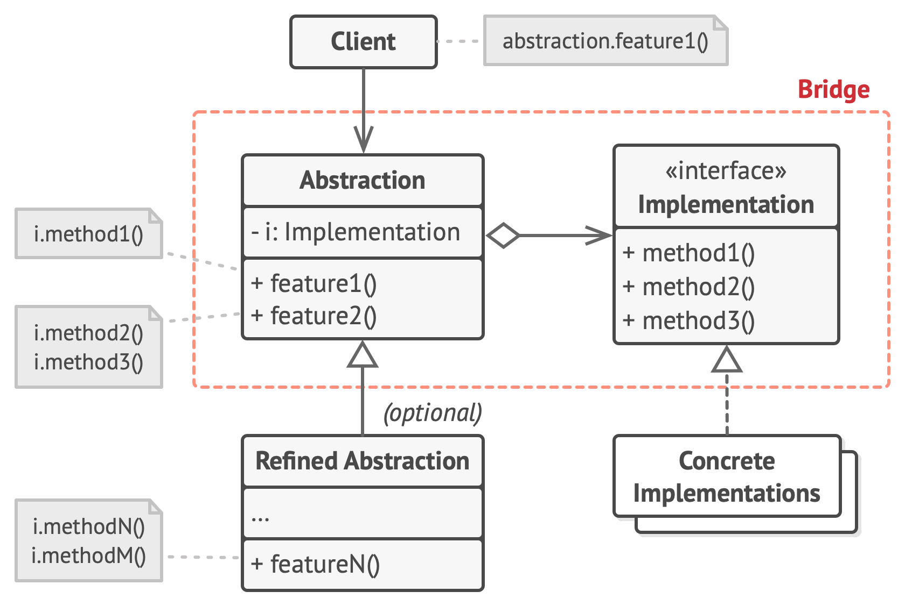

# Bridge

**Bridge** is a structural design pattern that lets you split a large class or a set of closely related classes into two separate hierarchies—abstraction and implementation—which can be developed independently of each other.

Frequency of use 

## Intent
* Decouple an abstraction from its implementation so that the two can vary independently.
* Publish interface in an inheritance hierarchy, and bury implementation in its own inheritance hierarchy.
* Beyond encapsulation, to insulation

## Problem
"Hardening of the software arteries" has occurred by using subclassing of an abstract base class to provide alternative implementations. This locks in compile-time binding between interface and implementation. The abstraction and implementation cannot be independently extended or composed.

## Structure

## Participants
The classes and objects participating in this pattern include:

* **Abstraction** (*BusinessObject*)
  * defines the abstraction's interface.
  * maintains a reference to an object of type Implementor.
* **RefinedAbstraction** (*CustomersBusinessObject*)
  * extends the interface defined by Abstraction.
* **Implementor** (*DataObject*)
  * defines the interface for implementation classes. This interface doesn't have to correspond exactly to Abstraction's interface; in fact the two interfaces can be quite different. Typically the Implementation interface provides only primitive operations, and Abstraction defines higher-level operations based on these primitives.
* **ConcreteImplementor** (*CustomersDataObject*)
  * implements the Implementor interface and defines its concrete implementation.
