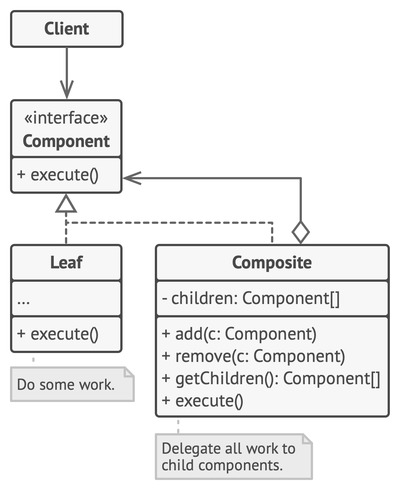

# Composite

**Composite** is a structural design pattern that lets you compose objects into tree structures and then work with these structures as if they were individual objects.

Frequency of use 

## Intent
* Compose objects into tree structures to represent whole-part hierarchies. Composite lets clients treat individual objects and compositions of objects uniformly.
* Recursive composition
* "Directories contain entries, each of which could be a directory."
* 1-to-many "has a" up the "is a" hierarchy

## Problem
Application needs to manipulate a hierarchical collection of "primitive" and "composite" objects. Processing of a primitive object is handled one way, and processing of a composite object is handled differently. Having to query the "type" of each object before attempting to process it is not desirable.

## Structure

## Participants
The classes and objects participating in this pattern include:

* **Component** (*DrawingElement*)
  * declares the interface for objects in the composition.
  * implements default behavior for the interface common to all classes, as appropriate.
  * declares an interface for accessing and managing its child components.
  * (optional) defines an interface for accessing a component's parent in the recursive structure, and implements it if that's appropriate.
* **Leaf** (*PrimitiveElement*)
  * represents leaf objects in the composition. A leaf has no children.
  * defines behavior for primitive objects in the composition.
* **Composite** (*CompositeElement*)
  * defines behavior for components having children.
  * stores child components.
  * implements child-related operations in the Component interface.
* **Client** (*CompositeApp*)
  * manipulates objects in the composition through the Component interface.