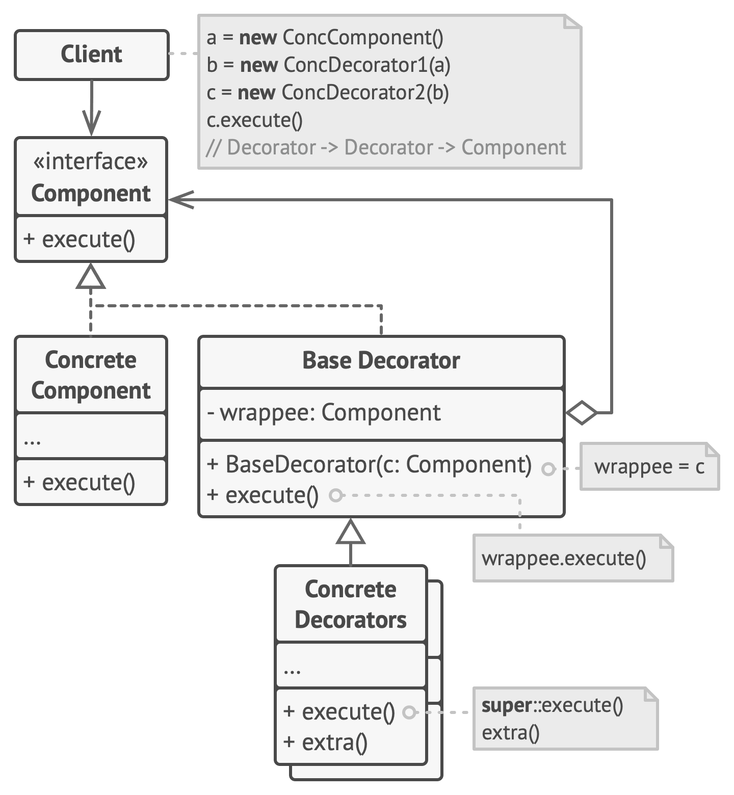

# Decorator

**Decorator** is a structural design pattern that lets you attach new behaviors to objects by placing these objects inside special wrapper objects that contain the behaviors.

Frequency of use 

## Intent
* Attach additional responsibilities to an object dynamically. Decorators provide a flexible alternative to subclassing for extending functionality.
* Client-specified embellishment of a core object by recursively wrapping it.
* Wrapping a gift, putting it in a box, and wrapping the box.

## Problem
You want to add behavior or state to individual objects at run-time. Inheritance is not feasible because it is static and applies to an entire class.

## Structure

## Participants
The classes and objects participating in this pattern include:

* **Component** (*LibraryItem*)
  * defines the interface for objects that can have responsibilities added to them dynamically.
* **ConcreteComponent** (*Book*, *Video*)
  * defines an object to which additional responsibilities can be attached.
* **Decorator** (*Decorator*)
  * maintains a reference to a Component object and defines an interface that conforms to Component's interface.
* **ConcreteDecorator** (*Borrowable*)
  * adds responsibilities to the component.