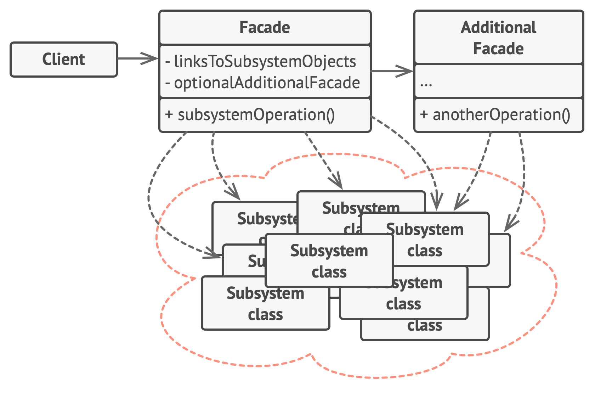

# Facade

**Facade** is a structural design pattern that provides a simplified interface to a library, a framework, or any other complex set of classes.

Frequency of use 

## Intent
* Provide a unified interface to a set of interfaces in a subsystem. Facade defines a higher-level interface that makes the subsystem easier to use.
* Wrap a complicated subsystem with a simpler interface.

## Problem
A segment of the client community needs a simplified interface to the overall functionality of a complex subsystem.

## Structure

## Participants
The classes and objects participating in this pattern include:

* **Facade** (*MortgageApplication*)
  * knows which subsystem classes are responsible for a request.
  * delegates client requests to appropriate subsystem objects.
* **Subsystem classes** (*Bank*, *Credit*, *Loan*)
  * implement subsystem functionality.
  * handle work assigned by the Facade object.
  * have no knowledge of the facade and keep no reference to it.