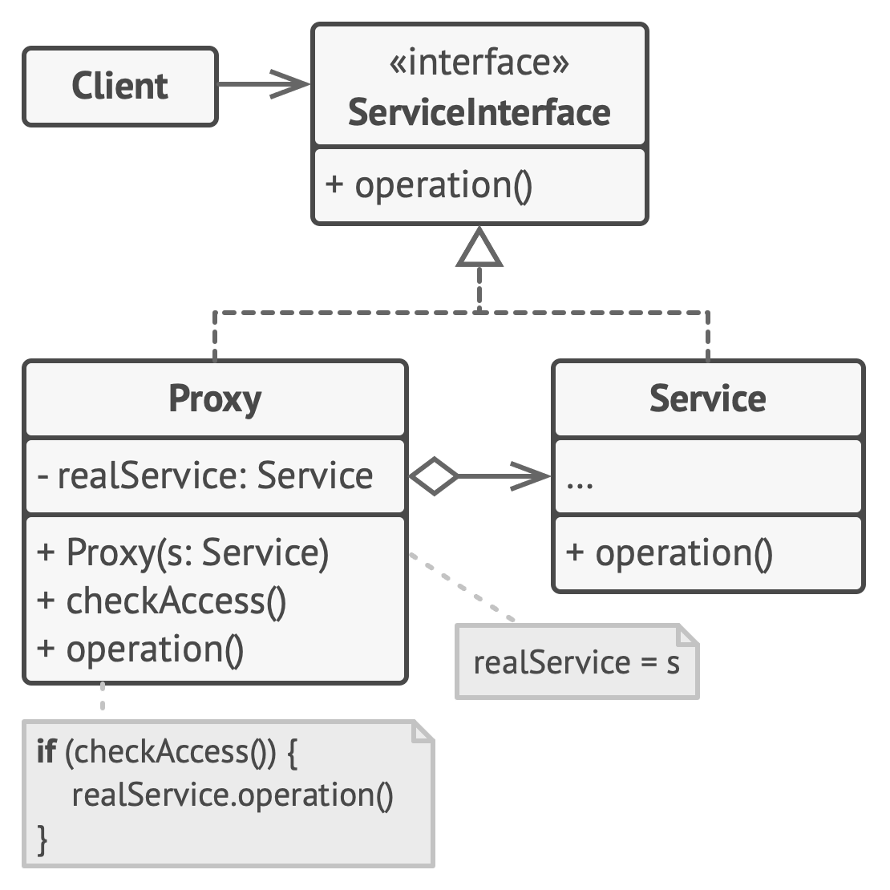

# Proxy

**Proxy** is a structural design pattern that lets you provide a substitute or placeholder for another object. A proxy controls access to the original object, allowing you to perform something either before or after the request gets through to the original object.

Frequency of use 

## Intent
* Provide a surrogate or placeholder for another object to control access to it.
* Use an extra level of indirection to support distributed, controlled, or intelligent access.
* Add a wrapper and delegation to protect the real component from undue complexity.

## Problem
You need to support resource-hungry objects, and you do not want to instantiate such objects unless and until they are actually requested by the client.

## Structure

## Participants
The classes and objects participating in this pattern include:

* **Proxy** (*MathProxy*)
  * maintains a reference that lets the proxy access the real subject. Proxy may refer to a Subject if the RealSubject and Subject interfaces are the same.
  * provides an interface identical to Subject's so that a proxy can be substituted for for the real subject.
  * controls access to the real subject and may be responsible for creating and deleting it.
  * other responsibilites depend on the kind of proxy:
    * remote proxies are responsible for encoding a request and its arguments and for sending the encoded request to the real subject in a different address space.
    * virtual proxies may cache additional information about the real subject so that they can postpone accessing it. For example, the ImageProxy from the Motivation caches the real images's extent.
    * protection proxies check that the caller has the access permissions required to perform a request.
* **Subject** (*IMath*)
  * defines the common interface for RealSubject and Proxy so that a Proxy can be used anywhere a RealSubject is expected.
* **RealSubject** (*Math*)
  * defines the real object that the proxy represents.